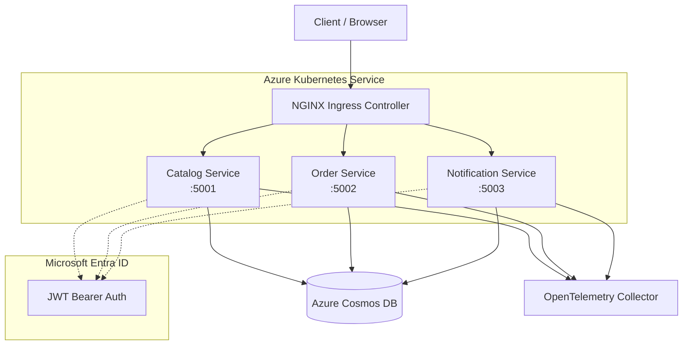

# Global Azure 2026 Demo - SRE Training Microservices

Azure SRE Agent および Azure Copilot Observability Agent の検証・教材用マイクロサービスアプリケーション。

## アーキテクチャ



## サービス構成

| サービス | ポート | エンドポイント数 | 説明 |
|---------|-------|----------------|------|
| CatalogService | 5001 | 10 | 商品カタログ、カテゴリ、在庫管理 |
| OrderService | 5002 | 8 | 注文管理、ステータス追跡 |
| NotificationService | 5003 | 6 | 通知配信、既読管理 |

## 技術スタック

- **Runtime**: .NET 10
- **Framework**: ASP.NET Core Minimal APIs
- **認証**: Microsoft Entra ID (JWT ベアラー認証)
- **データストア**: Azure Cosmos DB (NoSQL API)
- **テレメトリ**: OpenTelemetry (トレース + メトリクス + ログ)
- **ログ**: Serilog (構造化ログ)
- **コンテナ**: Docker (マルチステージビルド)
- **オーケストレーション**: Kubernetes (AKS)

## API エンドポイント一覧

### CatalogService (`/api/products`, `/api/categories`, `/api/inventory`)

| Method | Path | 説明 |
|--------|------|------|
| GET | `/api/products` | 商品一覧取得 |
| GET | `/api/products/{id}` | 商品詳細取得 |
| POST | `/api/products` | 商品登録 |
| PUT | `/api/products/{id}` | 商品更新 |
| DELETE | `/api/products/{id}` | 商品削除 |
| GET | `/api/products/search?q={query}` | 商品検索 ⚠️ |
| GET | `/api/categories` | カテゴリ一覧 |
| GET | `/api/categories/{id}` | カテゴリ詳細 |
| GET | `/api/inventory/{productId}` | 在庫確認 |
| PUT | `/api/inventory/{productId}` | 在庫更新 |

### OrderService (`/api/orders`)

| Method | Path | 説明 |
|--------|------|------|
| GET | `/api/orders` | 注文一覧 |
| GET | `/api/orders/{id}` | 注文詳細 |
| POST | `/api/orders` | 注文作成 |
| PUT | `/api/orders/{id}/status` | 注文ステータス更新 |
| DELETE | `/api/orders/{id}` | 注文削除 |
| GET | `/api/orders/user/{userId}` | ユーザー別注文 |
| POST | `/api/orders/{id}/cancel` | 注文キャンセル |
| GET | `/api/orders/{id}/total` | 注文合計計算 |

### NotificationService (`/api/notifications`)

| Method | Path | 説明 |
|--------|------|------|
| GET | `/api/notifications` | 通知一覧 |
| GET | `/api/notifications/{id}` | 通知詳細 |
| POST | `/api/notifications` | 通知作成 |
| PUT | `/api/notifications/{id}/read` | 既読マーク |
| GET | `/api/notifications/user/{userId}` | ユーザー別通知 |
| DELETE | `/api/notifications/{id}` | 通知削除 |

## ヘルスチェック エンドポイント

各サービスは、Kubernetes の Liveness / Readiness プローブに対応した一貫したヘルスチェック エンドポイントを公開しています。

### `GET /health` — Liveness プローブ

プロセスが生存しているかどうかのみを確認します。依存関係はチェックしません。

```json
{
  "status": "Healthy",
  "checks": []
}
```

### `GET /health/ready` — Readiness プローブ

以下の条件がすべて満たされた場合のみ `Healthy` を返します。

| チェック | 説明 |
|---|---|
| `cosmosdb` | `CosmosClient.ReadAccountAsync()` が成功すること |
| `startup` | Cosmos DB 初期化とシード投入が完了していること |

```json
{
  "status": "Healthy",
  "checks": [
    { "name": "cosmosdb", "status": "Healthy", "description": "Cosmos DB is reachable.", "duration": 42.3 },
    { "name": "startup", "status": "Healthy", "description": "Startup initialization complete.", "duration": 0.1 }
  ]
}
```

## ローカル開発

### 前提条件

- .NET 10 SDK
- Docker Desktop
- (オプション) Azure Cosmos DB Emulator

### docker-compose で起動

```bash
docker compose up --build
```

サービスは以下のポートでアクセスできます:
- CatalogService: http://localhost:5001
- OrderService: http://localhost:5002
- NotificationService: http://localhost:5003
- Cosmos DB Emulator: https://localhost:8081

開発モードでは認証がスキップされます (`Authentication:DisableAuth=true`)。

> **注意**: docker-compose 環境では `CosmosDb:AllowInsecureCertificate=true` が設定されています。
> これは Linux Cosmos DB エミュレーターの自己署名証明書を許可するための設定です。接続モード（Gateway）はこの設定とは別に `CosmosDb:ConnectionMode` で構成できます（未設定かつ `AllowInsecureCertificate=true` の場合は Gateway、それ以外は Direct がデフォルトです）。
> **本番環境では絶対に使用しないでください。**

### 個別サービスの起動

```bash
dotnet run --project src/CatalogService
dotnet run --project src/OrderService
dotnet run --project src/NotificationService
```

### ビルド

```bash
dotnet build GlobalAzureDemo2026.slnx
```

## AKS デプロイ

### 1. Azure リソースの準備

```bash
az group create --name rg-global-azure-demo --location japaneast

az aks create \
  --resource-group rg-global-azure-demo \
  --name aks-global-azure-demo \
  --node-count 2 \
  --node-vm-size Standard_B2s \
  --enable-managed-identity \
  --generate-ssh-keys

az cosmosdb create \
  --resource-group rg-global-azure-demo \
  --name cosmos-global-azure-demo \
  --capabilities EnableServerless \
  --locations regionName=japaneast

az acr create \
  --resource-group rg-global-azure-demo \
  --name acrglobalazuredemo \
  --sku Basic
```

### 2. Entra ID アプリ登録

#### 2-1. アプリ登録の作成

```bash
# アプリ登録を作成し、アプリケーション ID を取得
APP_ID=$(az ad app create --display-name "GlobalAzureDemo2026-API" --query appId -o tsv)
TENANT_ID=$(az account show --query tenantId -o tsv)

echo "TenantId : $TENANT_ID"
echo "ClientId : $APP_ID"
```

#### 2-2. App ID URI とスコープの設定

API として保護するために App ID URI を設定します。

```bash
# App ID URI を設定 (api://<appId> 形式)
az ad app update --id $APP_ID --identifier-uris "api://${APP_ID}"
```

続いて、サービス間 (client_credentials) アクセス用の **アプリ ロール** を追加します。
Azure portal の **[アプリの登録] → [アプリ ロール] → [アプリ ロールの作成]** で以下の値を入力してください。

| 項目 | 値 |
|------|----|
| 表示名 | `Access GlobalAzureDemo API` |
| 許可されるメンバーの種類 | `アプリケーション` |
| 値 | `Api.Access` |
| 説明 | `Allows a service to call the GlobalAzureDemo APIs` |
| このアプリ ロールを有効にする | オン |

> **注**: `az ad app update` による JSON パッチでロールを追加することもできますが、Portal 操作が最も確実です。

#### 2-3. サービスプリンシパルとクライアントシークレットの作成

```bash
# サービスプリンシパルを作成
az ad sp create --id $APP_ID

# クライアントシークレットを作成 (有効期限: 1年)
CLIENT_SECRET=$(az ad app credential reset --id $APP_ID --years 1 --query password -o tsv)

echo "ClientSecret を取得しました。安全な場所に保存してください。"
echo "Audience     : api://$APP_ID"
```

> ⚠️ `CLIENT_SECRET` は一度しか表示されません。必ず安全な場所に保存してください。

#### 2-4. アプリ ロールの管理者同意

```bash
# サービスプリンシパルの Object ID を取得
SP_OID=$(az ad sp show --id $APP_ID --query id -o tsv)

# アプリ ロールの appRoleId を取得
ROLE_ID=$(az ad app show --id $APP_ID \
  --query "appRoles[?value=='Api.Access'].id" -o tsv)

# 自身のサービスプリンシパルにロールを付与 (管理者同意)
az rest --method POST \
  --uri "https://graph.microsoft.com/v1.0/servicePrincipals/${SP_OID}/appRoleAssignments" \
  --body "$(jq -n \
    --arg pid "$SP_OID" \
    --arg rid "$SP_OID" \
    --arg aid "$ROLE_ID" \
    '{principalId: $pid, resourceId: $rid, appRoleId: $aid}')"
```

#### 2-5. Kubernetes シークレットの更新

アプリ登録の情報を Kubernetes シークレットに反映します。

```bash
kubectl create secret generic entra-id-secret \
  --namespace global-azure-demo \
  --from-literal=TenantId="${TENANT_ID}" \
  --from-literal=ClientId="${APP_ID}" \
  --from-literal=Audience="api://${APP_ID}" \
  --dry-run=client -o yaml | kubectl apply -f -
```

### 3. コンテナイメージのビルドとプッシュ

```bash
az acr login --name acrglobalazuredemo

docker build -t acrglobalazuredemo.azurecr.io/catalog-service:latest -f src/CatalogService/Dockerfile .
docker build -t acrglobalazuredemo.azurecr.io/order-service:latest -f src/OrderService/Dockerfile .
docker build -t acrglobalazuredemo.azurecr.io/notification-service:latest -f src/NotificationService/Dockerfile .

docker push acrglobalazuredemo.azurecr.io/catalog-service:latest
docker push acrglobalazuredemo.azurecr.io/order-service:latest
docker push acrglobalazuredemo.azurecr.io/notification-service:latest
```

### 4. Kubernetes デプロイ

```bash
kubectl apply -f k8s/namespace.yaml
kubectl apply -f k8s/catalog-service.yaml
kubectl apply -f k8s/order-service.yaml
kubectl apply -f k8s/notification-service.yaml
kubectl apply -f k8s/ingress.yaml
```

## Entra ID 認証フロー (AKS 環境)

AKS にデプロイされたサービスはすべて JWT ベアラー認証で保護されています。
以下の手順で Entra ID からアクセストークンを取得し、API を呼び出してください。

### 前提変数のセット

```bash
TENANT_ID="<YOUR_TENANT_ID>"   # az account show --query tenantId -o tsv
CLIENT_ID="<YOUR_CLIENT_ID>"   # アプリ登録の Application (client) ID
CLIENT_SECRET="<YOUR_CLIENT_SECRET>"
INGRESS_IP=$(kubectl get ingress global-azure-demo-ingress \
  -n global-azure-demo \
  -o jsonpath='{.status.loadBalancer.ingress[0].ip}')
```

### アクセストークンの取得 (client_credentials フロー)

```bash
TOKEN=$(curl -s -X POST \
  "https://login.microsoftonline.com/${TENANT_ID}/oauth2/v2.0/token" \
  -H "Content-Type: application/x-www-form-urlencoded" \
  -d "grant_type=client_credentials" \
  -d "client_id=${CLIENT_ID}" \
  -d "client_secret=${CLIENT_SECRET}" \
  -d "scope=api://${CLIENT_ID}/.default" \
  | jq -r .access_token)

echo "Token acquired: $([ -n "$TOKEN" ] && echo 'yes' || echo 'no')"
```

> `jq` がない場合は `python3 -c "import sys,json; print(json.load(sys.stdin)['access_token'])"` に置き換えてください。

### 認証付き API 呼び出しの例

```bash
# 商品一覧取得 (CatalogService)
curl -s -H "Authorization: Bearer $TOKEN" \
  http://$INGRESS_IP/catalog/api/products | jq .

# カテゴリ一覧取得 (CatalogService)
curl -s -H "Authorization: Bearer $TOKEN" \
  http://$INGRESS_IP/catalog/api/categories | jq .

# 注文一覧取得 (OrderService)
curl -s -H "Authorization: Bearer $TOKEN" \
  http://$INGRESS_IP/orders/api/orders | jq .

# 通知一覧取得 (NotificationService)
curl -s -H "Authorization: Bearer $TOKEN" \
  http://$INGRESS_IP/notifications/api/notifications | jq .
```

> トークンなしでアクセスすると HTTP **401 Unauthorized** が返ります:
> ```bash
> curl -o /dev/null -w "%{http_code}" http://$INGRESS_IP/catalog/api/products
> # → 401
> ```

### AKS 環境でのバグ再現 (認証付き)

#### プレミアム遅延パス

```bash
# "premium" クエリで意図的なスローダウンを発生させる
curl -s -H "Authorization: Bearer $TOKEN" \
  "http://$INGRESS_IP/catalog/api/products/search?q=premium"
```

- 期待される挙動: レスポンスに数秒かかる (Thread.Sleep ループ)
- OpenTelemetry でトレースを確認すると `SearchAsync` スパンの `duration` が肥大化していることが分かる

#### 長大クエリ 500 エラーパス

```bash
# 100文字を超えるクエリで ArgumentOutOfRangeException を発生させる
LONG_QUERY=$(python3 -c "print('a' * 150)")
curl -s -o /dev/null -w "%{http_code}" \
  -H "Authorization: Bearer $TOKEN" \
  "http://$INGRESS_IP/catalog/api/products/search?q=${LONG_QUERY}"
# → 500
```

- 期待される挙動: HTTP 500 が返る
- Application Insights / OpenTelemetry にスタックトレース付きの例外ログが記録される

## ⚠️ 意図的なバグ (SRE トレーニング用)

このアプリケーションには **教材目的** で1か所だけ意図的なパフォーマンス問題が埋め込まれています。

### 場所

`src/CatalogService/Services/ProductSearchService.cs` の `SearchAsync` メソッド

### トリガー条件

1. **スローダウン**: クエリパラメータ `q` に `premium` を含めてリクエスト
   ```bash
   curl http://localhost:5001/api/products/search?q=premium
   ```
   - 原因: `Thread.Sleep(100)` を含む同期ループで全商品を逐次処理
   - 結果: レスポンスタイムが数秒に膨張、スレッドプール枯渇

2. **500エラー**: クエリパラメータ `q` に100文字を超える文字列を送信
   ```bash
   curl "http://localhost:5001/api/products/search?q=$(python3 -c 'print("a"*150)')"
   ```
   - 原因: `String.Substring` の境界チェック不備
   - 結果: `ArgumentOutOfRangeException` → HTTP 500

## サンプルデータ

各サービス起動時に Cosmos DB へ自動投入:

| データ | 件数 | 説明 |
|--------|------|------|
| 商品 | 20 | 電子機器、衣料品、食品、書籍、プレミアム |
| カテゴリ | 5 | Electronics, Clothing, Food, Books, Premium |
| 在庫 | 20 | 各商品に対応 |
| 注文 | 10 | 様々なステータス |
| 通知 | 15 | 注文確認、出荷通知、プロモーション等 |

## ライセンス

MIT License
