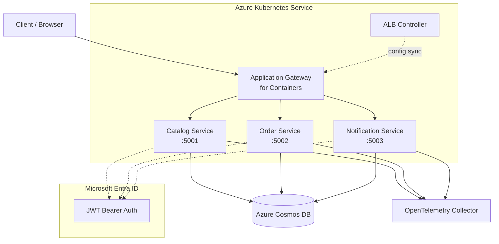

# Global Azure 2026 Demo - SRE Training Microservices

Azure SRE Agent および Azure Copilot Observability Agent の検証・教材用マイクロサービスアプリケーション。

## アーキテクチャ



> **Note**: Ingress NGINX は 2026 年 3 月にコミュニティ版が退役しました。本プロジェクトでは [Application Gateway for Containers (AGC)](https://learn.microsoft.com/azure/application-gateway/for-containers/overview) と Gateway API を使用しています。

## サービス構成

| サービス | ポート | エンドポイント数 | 説明 |
|---------|-------|----------------|------|
| CatalogService | 5001 | 10 | 商品カタログ、カテゴリ、在庫管理 |
| OrderService | 5002 | 8 | 注文管理、ステータス追跡 |
| NotificationService | 5003 | 6 | 通知配信、既読管理 |

## 技術スタック

- **Runtime**: .NET 10
- **Framework**: ASP.NET Core Minimal APIs
- **認証**: Microsoft Entra ID (JWT ベアラー認証)
- **データストア**: Azure Cosmos DB (NoSQL API)
- **テレメトリ**: OpenTelemetry (トレース + メトリクス + ログ)
- **ログ**: Serilog (構造化ログ)
- **コンテナ**: Docker (マルチステージビルド)
- **オーケストレーション**: Kubernetes (AKS)

## API エンドポイント一覧

### CatalogService (`/api/products`, `/api/categories`, `/api/inventory`)

| Method | Path | 説明 |
|--------|------|------|
| GET | `/api/products` | 商品一覧取得 |
| GET | `/api/products/{id}` | 商品詳細取得 |
| POST | `/api/products` | 商品登録 |
| PUT | `/api/products/{id}` | 商品更新 |
| DELETE | `/api/products/{id}` | 商品削除 |
| GET | `/api/products/search?q={query}` | 商品検索 ⚠️ |
| GET | `/api/categories` | カテゴリ一覧 |
| GET | `/api/categories/{id}` | カテゴリ詳細 |
| GET | `/api/inventory/{productId}` | 在庫確認 |
| PUT | `/api/inventory/{productId}` | 在庫更新 |

### OrderService (`/api/orders`)

| Method | Path | 説明 |
|--------|------|------|
| GET | `/api/orders` | 注文一覧 |
| GET | `/api/orders/{id}` | 注文詳細 |
| POST | `/api/orders` | 注文作成 |
| PUT | `/api/orders/{id}/status` | 注文ステータス更新 |
| DELETE | `/api/orders/{id}` | 注文削除 |
| GET | `/api/orders/user/{userId}` | ユーザー別注文 |
| POST | `/api/orders/{id}/cancel` | 注文キャンセル |
| GET | `/api/orders/{id}/total` | 注文合計計算 |

### NotificationService (`/api/notifications`)

| Method | Path | 説明 |
|--------|------|------|
| GET | `/api/notifications` | 通知一覧 |
| GET | `/api/notifications/{id}` | 通知詳細 |
| POST | `/api/notifications` | 通知作成 |
| PUT | `/api/notifications/{id}/read` | 既読マーク |
| GET | `/api/notifications/user/{userId}` | ユーザー別通知 |
| DELETE | `/api/notifications/{id}` | 通知削除 |

## ヘルスチェック エンドポイント

各サービスは、Kubernetes の Liveness / Readiness プローブに対応した一貫したヘルスチェック エンドポイントを公開しています。

### `GET /health` — Liveness プローブ

プロセスが生存しているかどうかのみを確認します。依存関係はチェックしません。

```json
{
  "status": "Healthy",
  "checks": []
}
```

### `GET /health/ready` — Readiness プローブ

以下の条件がすべて満たされた場合のみ `Healthy` を返します。

| チェック | 説明 |
|---|---|
| `cosmosdb` | `CosmosClient.ReadAccountAsync()` が成功すること |
| `startup` | Cosmos DB 初期化とシード投入が完了していること |

```json
{
  "status": "Healthy",
  "checks": [
    { "name": "cosmosdb", "status": "Healthy", "description": "Cosmos DB is reachable.", "duration": 42.3 },
    { "name": "startup", "status": "Healthy", "description": "Startup initialization complete.", "duration": 0.1 }
  ]
}
```

## ローカル開発

### Azure デプロイ前提条件

- .NET 10 SDK
- Docker Desktop
- (オプション) Azure Cosmos DB Emulator

### docker-compose で起動

```bash
docker compose up --build
```

サービスは以下のポートでアクセスできます:
- CatalogService: http://localhost:5001
- OrderService: http://localhost:5002
- NotificationService: http://localhost:5003
- Cosmos DB Emulator: https://localhost:8081

開発モードでは認証がスキップされます (`Authentication:DisableAuth=true`)。

> **注意**: docker-compose 環境では `CosmosDb:AllowInsecureCertificate=true` が設定されています。
> これは Linux Cosmos DB エミュレーターの自己署名証明書を許可するための設定です。接続モード（Gateway）はこの設定とは別に `CosmosDb:ConnectionMode` で構成できます（未設定かつ `AllowInsecureCertificate=true` の場合は Gateway、それ以外は Direct がデフォルトです）。
> **本番環境では絶対に使用しないでください。**

### 個別サービスの起動

```bash
dotnet run --project src/CatalogService
dotnet run --project src/OrderService
dotnet run --project src/NotificationService
```

### ビルド

```bash
dotnet build GlobalAzureDemo2026.slnx
```

## Azure Developer CLI + Bicep デプロイ

このリポジトリには、**教育用途で複数環境へ繰り返しデプロイできる** Azure Developer CLI (`azd`) + Bicep 構成が含まれています。

### 生成される Azure リソース

- Azure Container Apps Environment
- Azure Container Apps x 3
  - Catalog
  - Order
  - Notification
- Azure Container Registry (`Basic`)
- Azure Cosmos DB for NoSQL (`EnableServerless`)
- Cosmos SQL Database
- Log Analytics Workspace
- Application Insights

### 設計方針

- **コスト最適化優先**
  - AKS ではなく Container Apps を使用
  - 非 `prod` 環境は `minReplicas = 0`
  - ACR は `Basic`
  - Cosmos DB は `serverless`
- **Private Endpoint は未使用**
- **既定リージョンは `westus3`**
  - IaC 側の既定値として `westus3` を使用
  - `azd env new <env> -l westus3` で環境作成することを推奨
- **複数環境対応**
  - `AZURE_ENV_NAME` ベースでリソース名を分離
  - `dev` / `test` / `prod` / `workshop-a` などを並行運用可能

### 前提条件

- Azure Developer CLI (`azd`)
- Azure CLI (`az`)
- Docker Desktop
- .NET 10 SDK
- Azure サブスクリプションへのアクセス

### 環境ごとのセットアップ

`azd` は環境ごとに `.azure/<environment-name>/.env` を作成します。

まず環境を作成します。

```bash
azd env new dev -l westus3
```

次に、必須値を環境へ設定します。`scripts/setup-entra-app.ps1` を使用すると Entra ID 登録と値の設定が自動化されます (詳細は `docs/entra-app-setup.md` 参照)。

```bash
azd env set ENTRA_TENANT_ID <your-tenant-id>
azd env set ENTRA_CLIENT_ID <your-client-id>
azd env set ENTRA_AUDIENCE <identifier-uri-from-entra-registration>
```

> `ENTRA_AUDIENCE` には、Entra ID アプリ登録の App ID URI (識別子 URI) を指定します。`scripts/setup-entra-app.ps1` を使った場合は `api://<your-client-id>` 形式、Bicep テンプレートを使った場合は `api://<sanitized-display-name>` 形式になります。JWT の `aud` 検証はこの値と一致する必要があります。

必要に応じて追加設定も可能です。

```bash
azd env set ENVIRONMENT_TYPE dev
azd env set DISABLE_AUTH false
azd env set OPEN_TELEMETRY_ENDPOINT <optional-otlp-endpoint>
```

> 参考: 実際に `azd` が読むのは `.azure/<environment-name>/.env` です。必要な値は任意のメモに控えて管理してください。

### デプロイ前の確認

ローカル検証として以下は確認済みです。

- `infra/main.bicep`: 診断エラーなし
- `infra/modules/container-app.bicep`: 診断エラーなし
- `dotnet build GlobalAzureDemo2026.slnx`: 成功

ただし、Azure 側の事前確認には**実環境の Entra ID 値を設定した `azd` 環境**が必要です。

### デプロイの流れ

1. 環境を作成
2. 必須の `azd env set` を投入
3. Azure にサインイン
4. デプロイを実行

```bash
az login
azd up
```

### 環境を増やす例

```bash
azd env new test -l westus3
azd env new prod -l westus3
azd env new workshop-a -l westus3
```

各環境ごとに `.azure/<environment-name>/.env` が分離されるため、教育用途の並行検証に向いています。

### 主要ファイル

- `azure.yaml`
  - `azd` のサービス定義
- `infra/main.bicep`
  - 共有 Azure リソース + 各サービスのデプロイ
- `infra/modules/container-app.bicep`
  - 各 API サービス用の共通 Container App モジュール
- `infra/main.parameters.json`
  - `azd` 環境変数から Bicep パラメータへ受け渡し

## AKS デプロイ

### 1. Azure リソースの準備 (Bicep)

AKS、Application Gateway for Containers、VNet、Cosmos DB、ACR などを一括でプロビジョニングします。

Bash の場合:
```bash
# リソースグループを作成
az group create --name rg-global-azure-demo --location westus3

# Bicep でインフラをデプロイ
az deployment group create \
  --name main-aks \
  --resource-group rg-global-azure-demo \
  --template-file infra/main-aks.bicep \
  --parameters \
    environmentName=dev \
    entraTenantId=<YOUR_TENANT_ID> \
    entraClientId=<YOUR_CLIENT_ID> \
    entraAudience=<YOUR_AUDIENCE>
```

PowerShell の場合:
```powershell
# リソースグループを作成
az group create --name rg-global-azure-demo --location westus3

# Bicep でインフラをデプロイ
az deployment group create `
  --name main-aks `
  --resource-group rg-global-azure-demo `
  --template-file infra/main-aks.bicep `
  --parameters `
    environmentName=dev `
    entraTenantId=<YOUR_TENANT_ID> `
    entraClientId=<YOUR_CLIENT_ID> `
    entraAudience=<YOUR_AUDIENCE>
```

デプロイ完了後、以下の出力値を取得します:

Bash の場合:
```bash
# デプロイ出力を確認
az deployment group show \
  --resource-group rg-global-azure-demo \
  --name main-aks \
  --query properties.outputs -o json
```

PowerShell の場合:
```powershell
# デプロイ出力を確認
az deployment group show `
  --resource-group rg-global-azure-demo `
  --name main-aks `
  --query properties.outputs -o json
```

主要な出力値:

| 出力 | 説明 |
|------|------|
| `AKS_CLUSTER_NAME` | AKS クラスター名 |
| `ACR_LOGIN_SERVER` | ACR ログインサーバー |
| `AGC_RESOURCE_ID` | Application Gateway for Containers リソース ID |
| `AGC_FRONTEND_NAME` | Gateway から参照する AGC フロントエンド名 |
| `AGC_FRONTEND_FQDN` | AGC フロントエンド FQDN |
| `ALB_IDENTITY_CLIENT_ID` | ALB Controller 用マネージド ID |
| `COSMOS_ACCOUNT_NAME` | Cosmos DB アカウント名 |

### 2. Entra ID アプリ登録

#### 2-1. アプリ登録の作成

```bash
# アプリ登録を作成し、アプリケーション ID を取得
APP_ID=$(az ad app create --display-name "GlobalAzureDemo2026-API" --query appId -o tsv)
TENANT_ID=$(az account show --query tenantId -o tsv)

echo "TenantId : $TENANT_ID"
echo "ClientId : $APP_ID"
```

```powershell
# アプリ登録を作成し、アプリケーション ID を取得
$APP_ID = (az ad app create --display-name "GlobalAzureDemo2026-API" --query appId -o tsv)
$TENANT_ID = (az account show --query tenantId -o tsv)

Write-Host "TenantId : $TENANT_ID"
Write-Host "ClientId : $APP_ID"
```

#### 2-2. App ID URI とスコープの設定

API として保護するために App ID URI を設定します。

Bash の場合:
```bash
# App ID URI を設定 (api://<appId> 形式)
az ad app update --id $APP_ID --identifier-uris "api://${APP_ID}"
```

PowerShell の場合:
```powershell
# App ID URI を設定 (api://<appId> 形式)
az ad app update --id $APP_ID --identifier-uris "api://$APP_ID"
```

続いて、サービス間 (client_credentials) アクセス用の **アプリ ロール** を追加します。
Azure portal の **[アプリの登録] → [アプリ ロール] → [アプリ ロールの作成]** で以下の値を入力してください。

| 項目 | 値 |
| ------ | ---- |
| 表示名 | `Access GlobalAzureDemo API` |
| 許可されるメンバーの種類 | `アプリケーション` |
| 値 | `Api.Access` |
| 説明 | `Allows a service to call the GlobalAzureDemo APIs` |
| このアプリ ロールを有効にする | オン |

> **注**: `az ad app update` による JSON パッチでロールを追加することもできますが、Portal 操作が最も確実です。

#### 2-3. サービスプリンシパルとクライアントシークレットの作成

Bash の場合:
```bash
# サービスプリンシパルを作成
az ad sp create --id $APP_ID

# クライアントシークレットを作成 (有効期限: 1年)
CLIENT_SECRET=$(az ad app credential reset --id $APP_ID --years 1 --query password -o tsv)

echo "ClientSecret を取得しました。安全な場所に保存してください。"
echo "Audience     : api://$APP_ID"
```

PowerShell の場合:
```powershell
# サービスプリンシパルを作成
az ad sp create --id $APP_ID

# クライアントシークレットを作成 (有効期限: 1年)
$CLIENT_SECRET = (az ad app credential reset --id $APP_ID --years 1 --query password -o tsv)

Write-Host "ClientSecret を取得しました。安全な場所に保存してください。"
Write-Host "Audience     : api://$APP_ID"
```

> ⚠️ `CLIENT_SECRET` は一度しか表示されません。必ず安全な場所に保存してください。

#### 2-4. アプリ ロールの管理者同意

> **前提**: このステップでは `jq` を使用します。
> インストールされていない場合: `sudo apt-get install jq` (Debian/Ubuntu) または `brew install jq` (macOS)。
> `jq` が使えない場合の代替コマンドは以下に記載しています。

Bash の場合:
```bash
# サービスプリンシパルの Object ID を取得
SP_OID=$(az ad sp show --id $APP_ID --query id -o tsv)

# アプリ ロールの appRoleId を取得
ROLE_ID=$(az ad app show --id $APP_ID \
  --query "appRoles[?value=='Api.Access'].id" -o tsv)

# 自身のサービスプリンシパルにロールを付与 (管理者同意) — jq を使う場合
az rest --method POST \
  --uri "https://graph.microsoft.com/v1.0/servicePrincipals/${SP_OID}/appRoleAssignments" \
  --body "$(jq -n \
    --arg pid "$SP_OID" \
    --arg rid "$SP_OID" \
    --arg aid "$ROLE_ID" \
    '{principalId: $pid, resourceId: $rid, appRoleId: $aid}')"

# jq がない場合は python3 で JSON を組み立てる
# az rest --method POST \
#   --uri "https://graph.microsoft.com/v1.0/servicePrincipals/${SP_OID}/appRoleAssignments" \
#   --body "$(python3 -c "
# import json, sys
# print(json.dumps({'principalId': '${SP_OID}', 'resourceId': '${SP_OID}', 'appRoleId': '${ROLE_ID}'}))")"
```

PowerShell の場合:
```powershell
# サービスプリンシパルの Object ID を取得
$SP_OID = (az ad sp show --id $APP_ID --query id -o tsv)

# アプリ ロールの appRoleId を取得
$ROLE_ID = (az ad app show --id $APP_ID --query "appRoles[?value=='Api.Access'].id" -o tsv)

# 自身のサービスプリンシパルにロールを付与 (管理者同意)
$body = @{
    principalId = $SP_OID
    resourceId  = $SP_OID
    appRoleId   = $ROLE_ID
} | ConvertTo-Json

az rest --method POST `
  --uri "https://graph.microsoft.com/v1.0/servicePrincipals/$SP_OID/appRoleAssignments" `
  --body $body
```

#### 2-5. Kubernetes シークレットの更新

アプリ登録の情報を Kubernetes シークレットに反映します。

> ⚠️ **前提条件**: このステップを実行する前に、必ず AKS クラスターに接続してください。以下を確認してください。

**ステップ 2-5-1: AKS クラスターへの接続確認**

Bicep デプロイで出力された AKS クラスター名を使用して、kubectl コンテキストを設定します。

Bash の場合:
```bash
# AKS クラスター名を取得
AKS_NAME=$(az deployment group show -g rg-global-azure-demo -n main-aks --query properties.outputs.akS_CLUSTER_NAME.value -o tsv)

# AKS クラスターのクレデンシャルを取得
az aks get-credentials --resource-group rg-global-azure-demo --name $AKS_NAME --overwrite-existing

# 接続確認
kubectl cluster-info
kubectl config current-context

# Secret 登録先の namespace を先に作成
kubectl apply -f k8s/namespace.yaml
```

PowerShell の場合:
```powershell
# AKS クラスター名を取得
$AKS_NAME = (az deployment group show -g rg-global-azure-demo -n main-aks --query "properties.outputs.akS_CLUSTER_NAME.value" -o tsv)

# AKS クラスターのクレデンシャルを取得
az aks get-credentials --resource-group rg-global-azure-demo --name $AKS_NAME --overwrite-existing

# 接続確認
kubectl cluster-info
kubectl config current-context

# Secret 登録先の namespace を先に作成
kubectl apply -f k8s/namespace.yaml
```

接続が成功したら、以下のメッセージが表示されます。失敗した場合は、リソースグループ名、クラスター名、サブスクリプションを確認してください。

**ステップ 2-5-2: Kubernetes シークレットの作成**

Bash の場合:
```bash
kubectl create secret generic entra-id-secret \
  --namespace global-azure-demo \
  --from-literal=TenantId="${TENANT_ID}" \
  --from-literal=ClientId="${APP_ID}" \
  --from-literal=Audience="api://${APP_ID}" \
  --dry-run=client -o yaml | kubectl apply -f -

kubectl create secret generic cosmos-db-secret \
  --namespace global-azure-demo \
  --from-literal=ConnectionString="$(az cosmosdb keys list \
    --name $(az deployment group show -g rg-global-azure-demo -n main-aks --query properties.outputs.cosmoS_ACCOUNT_NAME.value -o tsv) \
    --resource-group rg-global-azure-demo \
    --type connection-strings \
    --query connectionStrings[0].connectionString -o tsv)" \
  --dry-run=client -o yaml | kubectl apply -f -
```

PowerShell の場合:
```powershell
# 2-1 の PowerShell 手順で取得した値を利用
# 別セッションで実行する場合は事前に設定してください
# $APP_ID = "<YOUR_CLIENT_ID>"
# $TENANT_ID = (az account show --query tenantId -o tsv)

# Cosmos DB の接続文字列を取得
$COSMOS_ACCOUNT_NAME = (az deployment group show -g rg-global-azure-demo -n main-aks --query "properties.outputs.cosmoS_ACCOUNT_NAME.value" -o tsv)
$CONNECTION_STRING = (az cosmosdb keys list `
  --name $COSMOS_ACCOUNT_NAME `
  --resource-group rg-global-azure-demo `
  --type connection-strings `
  --query "connectionStrings[0].connectionString" -o tsv)

# entra-id-secret を作成
kubectl create secret generic entra-id-secret `
  --namespace global-azure-demo `
  --from-literal="TenantId=$TENANT_ID" `
  --from-literal="ClientId=$APP_ID" `
  --from-literal="Audience=api://$APP_ID" `
  --dry-run=client -o yaml | kubectl apply -f -

# cosmos-db-secret を作成
kubectl create secret generic cosmos-db-secret `
  --namespace global-azure-demo `
  --from-literal="ConnectionString=$CONNECTION_STRING" `
  --dry-run=client -o yaml | kubectl apply -f -
```

> **注**: `k8s/catalog-service.yaml` にはプレースホルダー入りの Secret テンプレートが含まれていましたが、このテンプレートは `k8s/secrets.yaml` に分離されています。
> 上記 `kubectl` コマンドで実際の値を登録した後は、`k8s/secrets.yaml` を apply しないでください (上書きされます)。

### 3. コンテナイメージのビルドとプッシュ

Bash の場合:
```bash
# ACR をリソースグループから取得
ACR_NAME=$(az acr list -g rg-global-azure-demo --query "[0].name" -o tsv)
ACR_LOGIN_SERVER=$(az acr show -g rg-global-azure-demo -n "$ACR_NAME" --query loginServer -o tsv)

# az acr login はレジストリ名 (xxxx) を渡す
az acr login --name "$ACR_NAME"

docker build -t catalog-service:latest -f src/CatalogService/Dockerfile .
docker build -t order-service:latest -f src/OrderService/Dockerfile .
docker build -t notification-service:latest -f src/NotificationService/Dockerfile .

docker tag catalog-service:latest "$ACR_LOGIN_SERVER/catalog-service:latest"
docker tag order-service:latest "$ACR_LOGIN_SERVER/order-service:latest"
docker tag notification-service:latest "$ACR_LOGIN_SERVER/notification-service:latest"

docker push "$ACR_LOGIN_SERVER/catalog-service:latest"
docker push "$ACR_LOGIN_SERVER/order-service:latest"
docker push "$ACR_LOGIN_SERVER/notification-service:latest"
```

PowerShell の場合:
```powershell
# ACR をリソースグループから取得
$ACR_NAME = (az acr list -g rg-global-azure-demo --query "[0].name" -o tsv)
$ACR_LOGIN_SERVER = (az acr show -g rg-global-azure-demo -n $ACR_NAME --query "loginServer" -o tsv)

# az acr login はレジストリ名 (xxxx) を渡す
az acr login --name $ACR_NAME

docker build -t catalog-service:latest -f src/CatalogService/Dockerfile .
docker build -t order-service:latest -f src/OrderService/Dockerfile .
docker build -t notification-service:latest -f src/NotificationService/Dockerfile .

docker tag catalog-service:latest "$ACR_LOGIN_SERVER/catalog-service:latest"
docker tag order-service:latest "$ACR_LOGIN_SERVER/order-service:latest"
docker tag notification-service:latest "$ACR_LOGIN_SERVER/notification-service:latest"

docker push "$ACR_LOGIN_SERVER/catalog-service:latest"
docker push "$ACR_LOGIN_SERVER/order-service:latest"
docker push "$ACR_LOGIN_SERVER/notification-service:latest"
```

### 4. ALB Controller のインストール

この Bicep は **BYO (Bring Your Own) の AGC リソース** と、ALB Controller 用の **User Assigned Managed Identity + Federated Credential + 必要 RBAC** まで作成します。AKS クラスター側には、Helm で ALB Controller をインストールします。

Bash の場合:
```bash
# Bicep デプロイ名 (固定値にしない)
DEPLOYMENT_NAME="<YOUR_BICEP_DEPLOYMENT_NAME>"

# AKS クレデンシャルを取得
AKS_NAME=$(az deployment group show -g rg-global-azure-demo -n "$DEPLOYMENT_NAME" --query properties.outputs.akS_CLUSTER_NAME.value -o tsv)
ALB_CLIENT_ID=$(az deployment group show -g rg-global-azure-demo -n "$DEPLOYMENT_NAME" --query properties.outputs.alB_IDENTITY_CLIENT_ID.value -o tsv)

az aks get-credentials --resource-group rg-global-azure-demo --name $AKS_NAME

# Helm を利用して ALB Controller をインストール
helm upgrade --install alb-controller oci://mcr.microsoft.com/application-lb/charts/alb-controller \
  --namespace azure-alb-system \
  --create-namespace \
  --version 1.9.13 \
  --set albController.namespace=azure-alb-system \
  --set albController.podIdentity.clientID=$ALB_CLIENT_ID

# インストール確認
kubectl get pods -n azure-alb-system
kubectl get gatewayclass azure-alb-external -o yaml
```

PowerShell の場合:
```powershell
# Bicep デプロイ名 (固定値にしない)
$DEPLOYMENT_NAME = "<YOUR_BICEP_DEPLOYMENT_NAME>"

# AKS クレデンシャルを取得
$AKS_NAME = (az deployment group show -g rg-global-azure-demo -n $DEPLOYMENT_NAME --query "properties.outputs.akS_CLUSTER_NAME.value" -o tsv)
$ALB_CLIENT_ID = (az deployment group show -g rg-global-azure-demo -n $DEPLOYMENT_NAME --query "properties.outputs.alB_IDENTITY_CLIENT_ID.value" -o tsv)

az aks get-credentials --resource-group rg-global-azure-demo --name $AKS_NAME

# Helm を利用して ALB Controller をインストール
helm upgrade --install alb-controller oci://mcr.microsoft.com/application-lb/charts/alb-controller `
  --namespace azure-alb-system `
  --create-namespace `
  --version 1.9.13 `
  --set albController.namespace=azure-alb-system `
  --set albController.podIdentity.clientID=$ALB_CLIENT_ID

# インストール確認
kubectl get pods -n azure-alb-system
kubectl get gatewayclass azure-alb-external -o yaml
```

> 詳細は [ALB Controller (Helm) クイックスタート](https://learn.microsoft.com/azure/application-gateway/for-containers/quickstart-deploy-application-gateway-for-containers-alb-controller-helm) を参照してください。

### 5. Kubernetes デプロイ

> **注**: Secret は手順 2-5 の `kubectl create secret` コマンドで登録済みです。
> `k8s/secrets.yaml` はテンプレートとして提供されていますが、Secret を登録済みの場合は apply しないでください (実際の値がプレースホルダーで上書きされます)。

Bash / PowerShell の場合 (どちらも同じコマンド):
```bash
kubectl apply -f k8s/namespace.yaml
kubectl apply -f k8s/catalog-service.yaml
kubectl apply -f k8s/order-service.yaml
kubectl apply -f k8s/notification-service.yaml
```

### 6. Gateway API リソースのデプロイ

`k8s/gateway.yaml` の `<AGC_RESOURCE_ID>` と `<AGC_FRONTEND_NAME>` を Bicep デプロイで出力された値に置き換えてから適用します。

Bash の場合:
```bash
# AGC リソース ID を取得
AGC_ID=$(az deployment group show -g rg-global-azure-demo -n main-aks \
  --query properties.outputs.agC_RESOURCE_ID.value -o tsv)

# AGC フロントエンド名を取得
AGC_FRONTEND_NAME=$(az deployment group show -g rg-global-azure-demo -n main-aks \
  --query properties.outputs.agC_FRONTEND_NAME.value -o tsv)

# gateway.yaml のプレースホルダーを置換して適用
sed -e "s|<AGC_RESOURCE_ID>|${AGC_ID}|g" \
    -e "s|<AGC_FRONTEND_NAME>|${AGC_FRONTEND_NAME}|g" \
    k8s/gateway.yaml | kubectl apply -f -

# HTTPRoute を適用
kubectl apply -f k8s/httproutes.yaml
```

PowerShell の場合:
```powershell
# AGC リソース ID を取得
$AGC_ID = (az deployment group show -g rg-global-azure-demo -n main-aks --query "properties.outputs.AGC_RESOURCE_ID.value" -o tsv)

# AGC フロントエンド名を取得
$AGC_FRONTEND_NAME = (az deployment group show -g rg-global-azure-demo -n main-aks --query "properties.outputs.AGC_FRONTEND_NAME.value" -o tsv)

# gateway.yaml のプレースホルダーを置換して適用
(Get-Content k8s/gateway.yaml) `
  -replace '<AGC_RESOURCE_ID>', $AGC_ID `
  -replace '<AGC_FRONTEND_NAME>', $AGC_FRONTEND_NAME |
  kubectl apply -f -

# HTTPRoute を適用
kubectl apply -f k8s/httproutes.yaml
```

### 7. 動作確認

Bash の場合:
```bash
# Gateway のステータスを確認
kubectl get gateway -n global-azure-demo

# HTTPRoute のステータスを確認
kubectl get httproute -n global-azure-demo

# AGC フロントエンド FQDN を取得
AGC_FQDN=$(az deployment group show -g rg-global-azure-demo -n main-aks \
  --query properties.outputs.agC_FRONTEND_FQDN.value -o tsv)
echo "Endpoint: http://${AGC_FQDN}"
```

PowerShell の場合:
```powershell
# Gateway のステータスを確認
kubectl get gateway -n global-azure-demo

# HTTPRoute のステータスを確認
kubectl get httproute -n global-azure-demo

# AGC フロントエンド FQDN を取得
$AGC_FQDN = (az deployment group show -g rg-global-azure-demo -n main-aks --query "properties.outputs.AGC_FRONTEND_FQDN.value" -o tsv)
Write-Host "Endpoint: http://$AGC_FQDN"
```

### 8. トラブルシューティング

#### 問題: `kubectl apply` でエラー "dial tcp 127.0.0.1:8080: connectex: No connection could be made"

**原因**: kubectl が AKS クラスターに接続していません。

**解決方法**:

Bash の場合:
```bash
# 1. 接続しているクラスターを確認
kubectl config current-context

# 2. AKS に接続していない場合、クレデンシャルを取得
AKS_NAME=$(az deployment group show -g rg-global-azure-demo -n main-aks --query properties.outputs.akS_CLUSTER_NAME.value -o tsv)
az aks get-credentials --resource-group rg-global-azure-demo --name $AKS_NAME --overwrite-existing

# 3. 接続確認
kubectl cluster-info
kubectl get nodes
```

PowerShell の場合:
```powershell
# 1. 接続しているクラスターを確認
kubectl config current-context

# 2. AKS に接続していない場合、クレデンシャルを取得
$AKS_NAME = (az deployment group show -g rg-global-azure-demo -n main-aks --query "properties.outputs.akS_CLUSTER_NAME.value" -o tsv)
az aks get-credentials --resource-group rg-global-azure-demo --name $AKS_NAME --overwrite-existing

# 3. 接続確認
kubectl cluster-info
kubectl get nodes
```

#### 問題: Cosmos DB の接続文字列が取得できない

**原因**: リソースグループ名またはリソース名が正しくない可能性があります。

**解決方法**:

Bash の場合:
```bash
# Bicep デプロイの出力から Cosmos DB アカウント名を確認
az deployment group show \
  -g rg-global-azure-demo \
  -n main-aks \
  --query "properties.outputs.cosmoS_ACCOUNT_NAME.value" -o tsv

# リソースグループを確認
az group list --query "[].name" -o table
```

PowerShell の場合:
```powershell
# Bicep デプロイの出力から Cosmos DB アカウント名を確認
az deployment group show `
  -g rg-global-azure-demo `
  -n main-aks `
  --query "properties.outputs.cosmoS_ACCOUNT_NAME.value" -o tsv

# リソースグループを確認
az group list --query "[].name" -o table
```

#### 問題: Namespace `global-azure-demo` が存在しない

**解決方法**:

Bash / PowerShell の場合 (どちらも同じコマンド):
```bash
# namespace を作成
kubectl create namespace global-azure-demo
```

## Entra ID 認証フロー (AKS 環境)

AKS にデプロイされたサービスはすべて JWT ベアラー認証で保護されています。
以下の手順で Entra ID からアクセストークンを取得し、API を呼び出してください。

### 前提変数のセット

Bash の場合:
```bash
TENANT_ID="<YOUR_TENANT_ID>"   # az account show --query tenantId -o tsv
CLIENT_ID="<YOUR_CLIENT_ID>"   # アプリ登録の Application (client) ID
CLIENT_SECRET="<YOUR_CLIENT_SECRET>"
# AGC フロントエンド FQDN を取得
AGC_FQDN=$(kubectl get gateway global-azure-demo-gateway \
  -n global-azure-demo \
  -o jsonpath='{.status.addresses[0].value}')
if [ -z "$AGC_FQDN" ]; then
  AGC_FQDN=$(az deployment group show -g rg-global-azure-demo -n main-aks \
    --query properties.outputs.agC_FRONTEND_FQDN.value -o tsv)
fi

echo "AGC endpoint: ${AGC_FQDN}"
# 空の場合は以下で状態を確認:
# kubectl get gateway global-azure-demo-gateway -n global-azure-demo -o wide
```

PowerShell の場合:
```powershell
$TENANT_ID = "<YOUR_TENANT_ID>"   # az account show --query tenantId -o tsv
$CLIENT_ID = "<YOUR_CLIENT_ID>"   # アプリ登録の Application (client) ID
$CLIENT_SECRET = "<YOUR_CLIENT_SECRET>"
# AGC フロントエンド FQDN を取得
$AGC_FQDN = (kubectl get gateway global-azure-demo-gateway -n global-azure-demo -o jsonpath='{.status.addresses[0].value}' 2>$null)
if (-not $AGC_FQDN) {
  $AGC_FQDN = (az deployment group show -g rg-global-azure-demo -n main-aks --query "properties.outputs.AGC_FRONTEND_FQDN.value" -o tsv)
}

Write-Host "AGC endpoint: $AGC_FQDN"
# 空の場合は以下で状態を確認:
# kubectl get gateway global-azure-demo-gateway -n global-azure-demo -o wide
```

### アクセストークンの取得 (client_credentials フロー)

Bash の場合:
```bash
TOKEN=$(curl -s -X POST \
  "https://login.microsoftonline.com/${TENANT_ID}/oauth2/v2.0/token" \
  -H "Content-Type: application/x-www-form-urlencoded" \
  -d "grant_type=client_credentials" \
  -d "client_id=${CLIENT_ID}" \
  -d "client_secret=${CLIENT_SECRET}" \
  -d "scope=api://${CLIENT_ID}/.default" \
  | jq -r .access_token)

if [ -n "$TOKEN" ]; then
  echo "Token acquired: yes"
else
  echo "Token acquired: no"
fi
```

> `jq` がない場合は `python3 -c "import sys,json; print(json.load(sys.stdin)['access_token'])"` に置き換えてください。

PowerShell の場合:
```powershell
$tokenResponse = Invoke-RestMethod `
  -Method Post `
  -Uri "https://login.microsoftonline.com/$TENANT_ID/oauth2/v2.0/token" `
  -ContentType "application/x-www-form-urlencoded" `
  -Body "grant_type=client_credentials&client_id=$CLIENT_ID&client_secret=$CLIENT_SECRET&scope=api://$CLIENT_ID/.default"

$TOKEN = $tokenResponse.access_token
if ($TOKEN) { Write-Host "Token acquired: yes" } else { Write-Host "Token acquired: no" }
```

### 認証付き API 呼び出しの例

Bash の場合:
```bash
# 商品一覧取得 (CatalogService)
curl -s -H "Authorization: Bearer $TOKEN" \
  http://$AGC_FQDN/catalog/api/products | jq .

# カテゴリ一覧取得 (CatalogService)
curl -s -H "Authorization: Bearer $TOKEN" \
  http://$AGC_FQDN/catalog/api/categories | jq .

# 注文一覧取得 (OrderService)
curl -s -H "Authorization: Bearer $TOKEN" \
  http://$AGC_FQDN/orders/api/orders | jq .

# 通知一覧取得 (NotificationService)
curl -s -H "Authorization: Bearer $TOKEN" \
  http://$AGC_FQDN/notifications/api/notifications | jq .
```

> トークンなしでアクセスすると HTTP **401 Unauthorized** が返ります:
>
> ```bash
> curl -o /dev/null -w "%{http_code}" http://$AGC_FQDN/catalog/api/products
> # → 401
> ```

PowerShell の場合:
```powershell
$headers = @{ Authorization = "Bearer $TOKEN" }

# 商品一覧取得 (CatalogService)
Invoke-RestMethod -Uri "http://$AGC_FQDN/catalog/api/products" -Headers $headers

# カテゴリ一覧取得 (CatalogService)
Invoke-RestMethod -Uri "http://$AGC_FQDN/catalog/api/categories" -Headers $headers

# 注文一覧取得 (OrderService)
Invoke-RestMethod -Uri "http://$AGC_FQDN/orders/api/orders" -Headers $headers

# 通知一覧取得 (NotificationService)
Invoke-RestMethod -Uri "http://$AGC_FQDN/notifications/api/notifications" -Headers $headers
```

> トークンなしでアクセスすると HTTP **401 Unauthorized** が返ります:
>
> ```powershell
> (Invoke-WebRequest -Uri "http://$AGC_FQDN/catalog/api/products" -SkipHttpErrorCheck).StatusCode
> # → 401
> ```

### AKS 環境でのバグ再現 (認証付き)

#### プレミアム遅延パス

Bash の場合:
```bash
# "premium" クエリで意図的なスローダウンを発生させる
curl -s -H "Authorization: Bearer $TOKEN" \
  "http://$AGC_FQDN/catalog/api/products/search?q=premium"
```

PowerShell の場合:
```powershell
# "premium" クエリで意図的なスローダウンを発生させる
Invoke-RestMethod -Uri "http://$AGC_FQDN/catalog/api/products/search?q=premium" `
  -Headers @{ Authorization = "Bearer $TOKEN" }
```

- 期待される挙動: レスポンスに数秒かかる (Thread.Sleep ループ)
- OpenTelemetry でトレースを確認すると `SearchAsync` スパンの `duration` が肥大化していることが分かる

#### 長大クエリ 500 エラーパス

Bash の場合:
```bash
# 100文字を超えるクエリで ArgumentOutOfRangeException を発生させる
LONG_QUERY=$(python3 -c "print('a' * 150)")
curl -s -o /dev/null -w "%{http_code}" \
  -H "Authorization: Bearer $TOKEN" \
  "http://$AGC_FQDN/catalog/api/products/search?q=${LONG_QUERY}"
# → 500
```

PowerShell の場合:
```powershell
# 100文字を超えるクエリで ArgumentOutOfRangeException を発生させる
$LONG_QUERY = "a" * 150
$response = Invoke-WebRequest `
  -Uri "http://$AGC_FQDN/catalog/api/products/search?q=$LONG_QUERY" `
  -Headers @{ Authorization = "Bearer $TOKEN" } `
  -SkipHttpErrorCheck
$response.StatusCode  # → 500
```

- 期待される挙動: HTTP 500 が返る
- Application Insights / OpenTelemetry にスタックトレース付きの例外ログが記録される

## Azure SRE Agent Demo Integration

This repository includes a **complete, executable 20-minute demo** showing how the Azure SRE Agent detects incidents, routes them to Azure DevOps, GitHub, or both, and uses memory & reasoning to suggest resolutions.

### Quick Start

1. **Setup** — Configure SRE Agent resources (5 min)

   Bash の場合:
   ```bash
   az deployment group create \
     --resource-group <resource-group> \
     --template-file infra/main.bicep \
     --parameters \
       environmentName=<environment-name> \
       entraTenantId=<tenant-id> \
       entraClientId=<client-id> \
       entraAudience=<audience> \
       enableSreDemo=true \
       incidentRelayResourceId=<logic-app-resource-id> \
       incidentRelayCallbackUrl=<logic-app-callback-url> \
       responseTimeThresholdMs=500 \
       failedRequestCountThreshold=5
   ```

   PowerShell の場合:
   ```powershell
   az deployment group create `
     --resource-group <resource-group> `
     --template-file infra/main.bicep `
     --parameters `
       environmentName=<environment-name> `
       entraTenantId=<tenant-id> `
       entraClientId=<client-id> `
       entraAudience=<audience> `
       enableSreDemo=true `
       incidentRelayResourceId=<logic-app-resource-id> `
       incidentRelayCallbackUrl=<logic-app-callback-url> `
       responseTimeThresholdMs=500 `
       failedRequestCountThreshold=5
   ```

2. **Run the Demo** — Complete incident cycle (20 min)
   - See: [SRE Scenario - 20 Minute Demo](./docs/sre-scenario-20min.md)

### Key Features

✅ **Azure Monitor Alerts** — Auto-detect latency & error rate anomalies
✅ **Azure DevOps Integration** — Work items can be created automatically through an Azure relay
✅ **GitHub Integration** — Issues can be created from the same Azure Monitor incident through an Azure relay
✅ **SRE Agent Memory & Runbooks** — Knowledge base for incident response
✅ **Agent Reasoning** — Suggests root causes with confidence scores
✅ **End-to-End Demo** — Executable in 20 minutes

### Documentation

- **[SRE Agent Setup Guide](./docs/sre-agent-setup.md)** — Complete setup instructions + prerequisites
- **[SRE Agent Setup Guide (Japanese)](./docs/sre-agent-setup_ja.md)** — 日本語版セットアップガイド
- **[20-Minute Scenario](./docs/sre-scenario-20min.md)** — Executable demo with expected outputs
- **[20-Minute Scenario (Japanese)](./docs/sre-scenario-20min_ja.md)** — 日本語版デモシナリオ
- **[Azure SRE Agent Official Docs](https://sre.azure.com)** — Full reference

### Architecture

```
Microservices → OpenTelemetry → Application Insights
    ↓
Log Analytics (30-day retention)
    ↓
Alert Rules (latency, error rate)
    ↓
Action Group → Logic App / Azure Function
    ↓
Azure DevOps Work Item and/or GitHub Issue
    ↓
SRE Agent (reads incident + memory + telemetry)
    ↓
Agent Reasoning → Suggests root cause & resolution
```

### Resources Deployed (when enabled)

- 2 Metric Alert Rules (latency, failed requests)
- 1 Action Group (routes to Azure-native relay for Azure DevOps and/or GitHub)
- 1 Scheduled Query Alert (custom incident detection)
- Diagnostic Settings on Container Apps Environment

---

## ⚠️ 意図的なバグ (SRE トレーニング用)

このアプリケーションには **教材目的** で1か所だけ意図的なパフォーマンス問題が埋め込まれています。

### 場所

`src/CatalogService/Services/ProductSearchService.cs` の `SearchAsync` メソッド

### トリガー条件

1. **スローダウン**: クエリパラメータ `q` に `premium` を含めてリクエスト

   ```bash
   curl http://localhost:5001/api/products/search?q=premium
   ```

   - 原因: `Thread.Sleep(100)` を含む同期ループで全商品を逐次処理
   - 結果: レスポンスタイムが数秒に膨張、スレッドプール枯渇

2. **500エラー**: クエリパラメータ `q` に100文字を超える文字列を送信

   ```bash
   curl "http://localhost:5001/api/products/search?q=$(python3 -c 'print("a"*150)')"
   ```

   - 原因: `String.Substring` の境界チェック不備
   - 結果: `ArgumentOutOfRangeException` → HTTP 500

## サンプルデータ

各サービス起動時に Cosmos DB へ自動投入:

| データ | 件数 | 説明 |
| ------ | ---- | ---- |
| 商品 | 20 | 電子機器、衣料品、食品、書籍、プレミアム |
| カテゴリ | 5 | Electronics, Clothing, Food, Books, Premium |
| 在庫 | 20 | 各商品に対応 |
| 注文 | 10 | 様々なステータス |
| 通知 | 15 | 注文確認、出荷通知、プロモーション等 |

## ライセンス

MIT License
